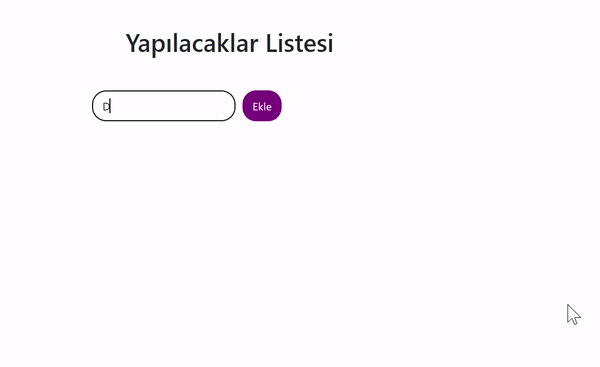

<h1> Yapılacaklar Listesi</h1>

React ve Axios kütüphanelerini kullanarak basit bir yapılacaklar uygulaması geliştirdiğim bu uygulama kullanıcının yapılacakları takip etmesine ve yönetmesine olanak tanır.

<h2> Axios Nedir? </h2>

Axios, JavaScript tabanlı web tarayıcılarında ve Node.js üzerinde çalışabilen bir HTTP istemci kütüphanesidir. HTTP istekleri yapmak ve yanıtları işlemek için kullanılır. Axios, Promise tabanlı bir yapıya sahiptir ve modern tarayıcılarla ve Node.js ortamında yaygın olarak kullanılır.

Özellikleri:

<ul>
<li>JSON verileri için otomatik dönüşüm.</li>
<li>İsteğe bağlı istek iptalleri</li>
<li>Yanıtları sıralamak için kısayollar.</li>
<li>Hata yönetimi ve hata durumunda geri bildirim sağlar.</li>
</ul>

<h2> React Nedir? </h2>
React, Facebook tarafından geliştirilen ve kullanıcı arayüzlerini oluşturmak için kullanılan bir JavaScript kütüphanesidir. Özellikle tek sayfa uygulamaları (SPA) için ideal olan bir bileşen tabanlı yapı sunar. Bu uygulamaları küçük, bağımsız bileşenlere bölmeyi ve bu bileşenleri birleştirmeyi kolaylaştırır.

Özellikleri:

<ul>
<li><b>Bileşen Tabanlı: </b>Uygulamalar, bağımsız bileşenler aracılığıyla inşa edilir. Bu, kodun modüler ve yönetilebilir olmasını sağlar. </li>
<li><b>Sanal DOM: </b>: React, DOM manipülasyonlarını optimize etmek için sanal bir DOM kullanır ve bu da uygulamanın daha hızlı ve verimli çalışmasını sağlar </li>
<li><b>JSX: </b>JavaScript XML (JSX), HTML benzeri bir söz dizimi sunar ve React bileşenlerini oluşturmak için yaygın olarak kullanılır.</li>
</ul>

React genellikle modern web uygulamalarının oluşturulmasında tercih edilen bir kütüphanedir ve birçok büyük projede kullanılmaktadır.

<h2>Proje İçeriği</h2>
<ul>
<li><b>App.js: </b>Ana uygulama bileşeni. Yapılacakları listeler ve kullanıcının etkileşimlerini yönetir.</li>
<li><b>CustomButton.js: </b> Özel düğme bileşeni. Farklı renk ve stillere sahip düğmeler oluşturmak için kullanılır.</li>
<li><b>CustomInput.js: </b>Özel giriş alanı bileşeni. Özelleştirilebilir ve stilize edilebilir bir giriş alanı sağlar.</li>
</ul>

<h2>Kullanım</h2>

<ul>
<li>Yeni görev eklemek için, giriş alanına metin yazın ve "Ekle" düğmesine tıklayın.</li>
<li>Görevi tamamlamak veya devam ettirmek için, yanındaki onay kutusunu işaretleyin.</li>
<li> Görevi silmek için, "Sil" düğmesine tıklayın.</li>
</ul>

<h2>Kullanılan Teknolojiler</h2>
<ul>
<li>Html</li>
<li>Css</li>
<li>JavaScript</li>
<li>React</li>
<li>Axios</li>
</ul>

<h2>Ekran Görüntüsü</h2>

